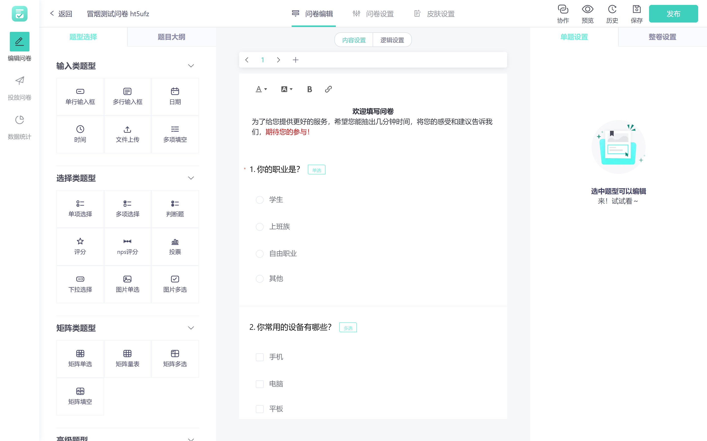
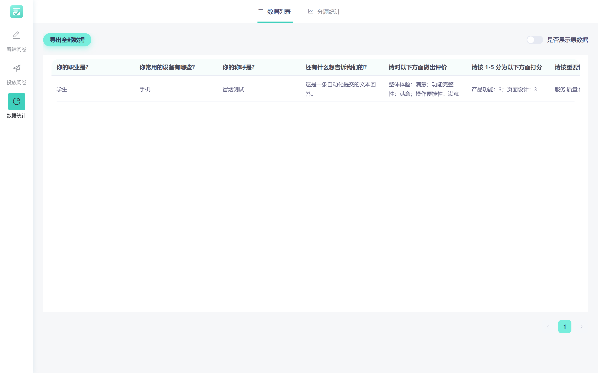

<div align="center">

# OpenSurvey

**开源在线问卷与调查平台**

自托管 · 零广告 · 零追踪 · 数据留在自己机器上

</div>

---

## 这是什么

OpenSurvey 是一套可以完整私有部署的在线问卷系统：从**出题 → 投放 → 收答卷 → 看统计 → 导数据**，
整条链路都在你自己的服务器上跑完，不依赖任何第三方服务。

面向的场景很朴素：学校做问卷、社团收报名、小团队做满意度调研 —— 这些事不该把数据交给别人的服务器，
也不该被广告和追踪脚本围着。

**已经做到的**：

- 单进程部署 —— 生产模式下**一个 Node 进程同时托管前端页面与 API**，连 nginx 都不是必需的
- **完全离线可用** —— 图标字体已本地自托管，不再依赖任何 CDN
- 数据可携带 —— MongoDB 数据目录拷走即迁移

---

## 界面

| 答题端（受访者看到的） | 问卷编辑器 |
| --- | --- |
|  |  |

| 数据统计 | 登录页 |
| --- | --- |
|  |  |

---

## 功能

### 题型（13 种）

| 分类 | 题型 |
| --- | --- |
| 输入 | 单行输入框、多行输入框 |
| 选择 | 单项选择、多项选择、判断题、评分、NPS 评分、投票 |
| 矩阵 | 矩阵单选、矩阵量表 |
| 高级 | 多级联动（省市区等层级选择）、排序、滑块量表 |

每一题都可以单独设置：必填、选项随机、显示题号 / 题型标签 / 分隔线、配额显示、
文本长度校验、数字范围校验、选项互斥与「其他」补充项、题目备注说明。

### 问卷编辑

- **可视化编辑器** —— 拖拽添加题型，左侧题库、中间画布、右侧属性面板
- **逻辑编排** —— 显示逻辑（满足条件才出现）与跳转逻辑（按选项跳到指定题），画布式配置
- **皮肤设置** —— 主题色、背景（纯色 / 图片）、内容区透明度、自定义 Logo
- **模板** —— 4 套内置模板：普通问卷、NPS 调研、报名登记、投票
- **创建方式** —— 空白创建、文本批量导入、Excel 导入
- **实时预览** —— 手机 / PC 双端预览

### 投放与回收

- 发布链接、渠道管理（多渠道路径分别统计回收量）
- 二维码生成、iframe 嵌入代码一键复制
- 白名单限制、访问密码保护

### 数据与导出

- **回收数据表** —— 支持显示原值 / 脱敏两种视图
- **分题统计** —— 按题聚合的图表统计
- **导出 XLSX** —— 走异步下载任务，大数据量不阻塞页面
- **下载中心** —— 导出任务统一管理

### 协作与账号

- 团队空间、分组管理、协同编辑（可邀请协作者）
- 回收站（软删除可恢复）、操作历史
- 注册 / 登录 / 图形验证码 / JWT 鉴权

### 安全

- 请求签名校验 + RSA 加密传输
- 答卷内容 AES 加密存储
- 白名单与访问密码双通道投放控制

---

## 技术栈

| 层 | 选型 |
| --- | --- |
| 前端 | Vue 3 + Vite（MPA 双入口：`management` 管理端 / `render` 答题端）+ Element Plus + ECharts + LogicFlow |
| 后端 | NestJS + TypeORM |
| 数据库 | MongoDB |
| 部署 | Node.js ≥ 18（Docker 镜像基于 `node:18-slim`），无需 nginx |

前端刻意做成**双入口 MPA**：答题端与管理端各自打包，答题端不加载管理端的重型依赖，
在手机上的首屏速度会明显好于单页应用。

---

## 快速开始

### 方式一：本地跑起来（推荐先用这个验证）

需要 Node.js ≥ 18。**不需要预先安装 MongoDB** —— 开发模式下会自动拉起一个内存版实例。

```bash
# 1. 服务端（会自动启动内存 MongoDB，并打印连接串）
cd server
npm install
npm run local

# 2. 前端（另开一个终端）
cd web
npm install
npm run dev
```

打开 <http://127.0.0.1:8080/management>，注册一个账号即可开始。

> 内存版 MongoDB 的数据**在进程退出后会丢失**，适合开发与演示。
> 要保留数据，设好 `OPENSURVEY_MONGO_URL` 指向真实 MongoDB 再启动即可。

### 方式二：生产模式（单进程）

```bash
# 服务端构建
cd server
npm install
npm run build

# 前端构建（产出 management.html + render.html）
cd ../web
npm install
npm run build-only

# 单进程启动：同时托管页面与 API
cd ../server
NODE_ENV=production OPENSURVEY_MONGO_URL="mongodb://127.0.0.1:27017" PORT=3000 node dist/main
```

启动后 `/management`、`/render/*`、`/api/*` 都由这**一个进程**提供，无需再挂反向代理。

### 方式三：Docker

```bash
docker build -t opensurvey:latest .
docker run -d --name opensurvey \
  -p 8080:8080 \
  -e OPENSURVEY_MONGO_URL="mongodb://<user>:<pass>@<host>:27017" \
  -e OPENSURVEY_JWT_SECRET="换成你自己的随机串" \
  -e OPENSURVEY_RESPONSE_AES_ENCRYPT_SECRET_KEY="换成你自己的随机串" \
  opensurvey:latest
```

### 方式四：Docker Compose（连数据库一起）

仓库内 `docker-compose.yaml` 会**就地构建**镜像并拉起一个 MongoDB：

```bash
export MONGO_INITDB_ROOT_USERNAME=root
export MONGO_INITDB_ROOT_PASSWORD=换成强密码
export OPENSURVEY_JWT_SECRET=$(openssl rand -hex 32)
export OPENSURVEY_RESPONSE_AES_ENCRYPT_SECRET_KEY=$(openssl rand -hex 32)

docker compose up -d --build
```

---

## 环境变量

服务端按 `NODE_ENV` 读取 `server/.env` / `.env.development` / `.env.production`。

| 变量 | 说明 | 默认 |
| --- | --- | --- |
| `OPENSURVEY_MONGO_URL` | MongoDB 连接串 | 空（必填） |
| `OPENSURVEY_MONGO_DB_NAME` | 数据库名 | `opensurvey` |
| `OPENSURVEY_MONGO_AUTH_SOURCE` | Mongo 认证库（用官方镜像的 root 账号时为 `admin`） | 空 |
| `OPENSURVEY_JWT_SECRET` | JWT 签名密钥 | **部署前务必改掉** |
| `OPENSURVEY_JWT_EXPIRES_IN` | 登录态有效期 | `8h` |
| `OPENSURVEY_RESPONSE_AES_ENCRYPT_SECRET_KEY` | 答卷 AES 加密密钥 | **部署前务必改掉** |
| `OPENSURVEY_HTTP_DATA_ENCRYPT_TYPE` | 传输加密方式 | `rsa` |
| `OPENSURVEY_LOGGER_FILENAME` | 日志文件路径 | `./logs/app.log` |
| `PORT` | 服务端口 | `3000` |
| `OPENSURVEY_REDIS_*` | 可选，Redis 连接信息 | 空 |

---

## 目录结构

```
OpenSurvey/
├── server/                     # NestJS 服务端
│   ├── src/
│   │   ├── modules/            # auth / survey / surveyResponse / channel / workspace / file ...
│   │   ├── models/             # TypeORM 实体
│   │   ├── guards/             # 鉴权与权限守卫
│   │   └── securityPlugin/     # 请求签名与加解密
│   ├── scripts/
│   │   ├── run-local.ts        # 本地启动（含内存 MongoDB）
│   │   └── smoke-test.mjs      # 端到端冒烟测试
│   └── .env*                   # 环境变量
├── web/                        # Vue3 + Vite 前端（MPA）
│   ├── public/                 # 静态资源（品牌资源、字体、题型缩略图）
│   └── src/
│       ├── management/         # 管理端
│       ├── render/             # 答题端
│       └── materials/          # 题型物料（编辑器与答题端共用）
├── docs/                       # 文档、品牌源文件、截图
├── nginx/nginx.conf            # 如需前置 nginx 可直接用
├── Dockerfile / Dockerfile.full
└── docker-compose.yaml
```

---

## 自检

仓库带了一个端到端冒烟测试，覆盖 **验证码 → 注册 → 登录 → 建问卷 → 存题 → 发布 → 答题 → 统计 → 导出** 全链路，
并断言了矩阵 / 排序 / 滑块题的取值与还原结果。

```bash
# 先起服务端（npm run local），它会打印内存 MongoDB 的连接串
cd server
MONGO_URL="<上面打印的连接串>" node scripts/smoke-test.mjs
```

预期输出 `15/15 项通过`。

其它自检：

```bash
cd server && npx tsc --noEmit        # 类型检查
cd web && npm run build-only          # 前端生产构建
```

---

## 已知限制

这部分如实写出来，免得踩坑：

- **分题统计目前只覆盖「选项型」与「数值型」题目** —— 矩阵 / 排序 / 滑块 / 比重 / 多项填空
  这类取值不是标量的题型，数据在「回收数据表」和导出的 XLSX 里完整可读，只是分题统计页不出图
- **没有考试评分 / 判分**能力（无标准答案、无自动得分）
- **没有交叉分析**（多题交叉制表）
- **没有抽奖 / 红包**一类营销玩法
- 导出格式目前只有 XLSX，没有 CSV / SPSS / PDF
- 内置模板 4 套，不是「模板库」级别的数量

---

## 参与贡献

1. 较大的改动请先开 Issue 说明，避免白做工
2. 提交前请跑一遍上面「自检」一节的三个命令
3. PR 请一个 PR 只做一件事，描述里写清改了什么

---

## 开源协议

[Apache License 2.0](LICENSE)

---

## 致谢

本项目的服务端与前端底座来自开源项目 **[xiaoju-survey](https://github.com/didi/xiaoju-survey)**（Apache-2.0）。
感谢该项目作者与贡献者的开源工作 —— 没有这个底座，就不会有 OpenSurvey。

在此之上，本项目重新设计了品牌视觉与交互主题、移除了全部 AI 生成功能、
把可选题型从 9 种扩展到 25 种，并修正了若干数据链路问题。详细的修改说明见 [NOTICE](NOTICE)。
